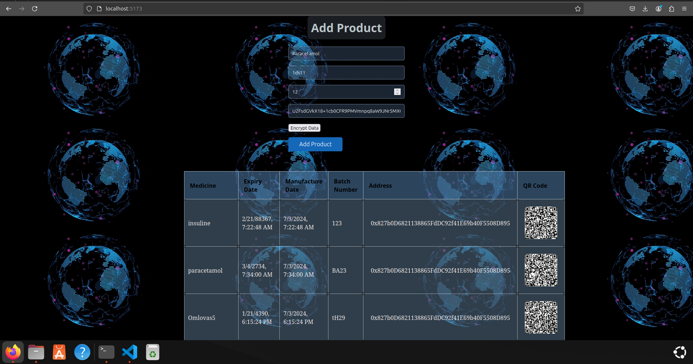

# Medicine Counterfeiting Verification System

This project is a decentralized platform to verify the authenticity of medicines using blockchain technology. The system allows manufacturers to enter details of each medicine they produce, encrypts the data, and generates a QR code that can be scanned to verify the authenticity of the medicine. This solution helps combat counterfeit drugs and ensures consumers receive genuine products.

## Features

- **Manufacturer Data Entry**: Allows manufacturers to input the details of the medicine they produce, such as name, batch number, manufacturing date, expiry date, etc.
- **Data Encryption**: The entered data is securely encrypted before being stored on the blockchain to prevent tampering.
- **QR Code Generation**: A unique QR code is generated for each batch of medicine. This QR code is linked to the encrypted data on the blockchain.
- **Authenticity Verification**: Consumers can scan the QR code on the product to check its authenticity and retrieve the details stored on the blockchain.
- **Blockchain-Backed**: All data is securely stored on the Ethereum blockchain using smart contracts, ensuring transparency and immutability.
- **Decentralized**: No central authority manages the data, ensuring complete decentralization of the medicine verification process.

## Tech Stack

- **Frontend**:
  - React
  - QR Code Generator (for displaying the QR code)

- **Backend**:
  - Hardhat (Ethereum development environment)
  - Solidity (for smart contracts)
  

## Getting Started

Follow these steps to run the project locally on your machine:


1. Install **Hardhat** globally:
   ```bash
   npm install --save-dev hardhat
   
2. Clone the repository:
   ```bash
   git clone https://github.com/Maman08/Medicine--Authenticity.git

3. Navigate to the project directory: 
   ```bash
   cd Medicine--Authenticity/client

4. Install dependencies:\
   ```bash
   npm i

5. Start the development server: 
   ```bash
   npm run dev   
   
